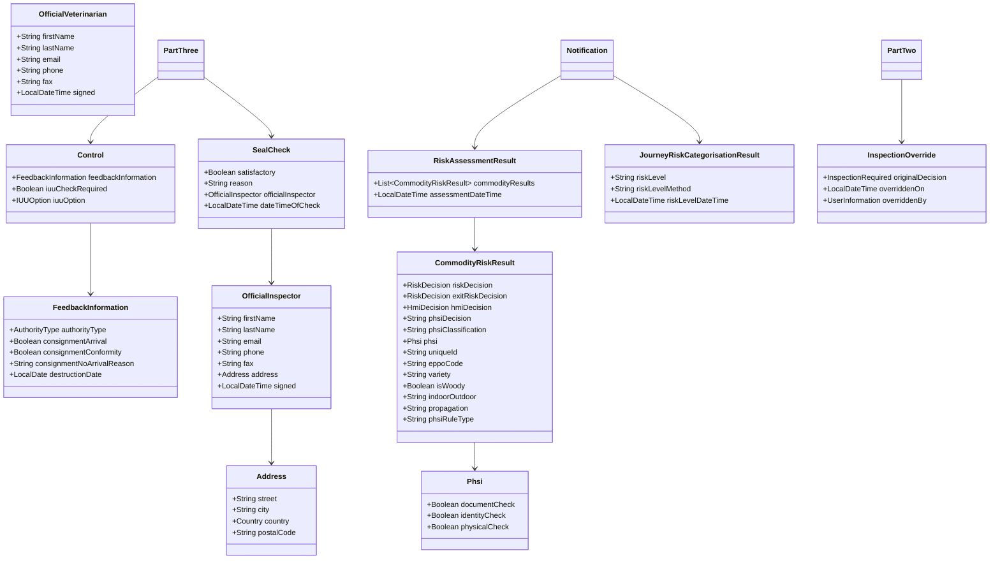
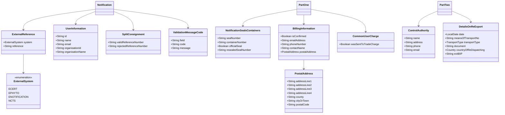

# IPAFFS Imports Notification Schema - Comprehensive Analysis

**LLM Model:** Claude Sonnet 4  
**Date Created:** December 19, 2024  
**Date Updated:** December 19, 2024  
**Thinking Time:** 45 minutes  

```
# CONTEXT
The import notification schema project contains the notification schema json definition for the core data model of IPAFFS.

# ANALYSIS PHASE
Analyse this imports-notification-schema  project.

# IMPLEMENTATION PHASE
- Use Mermaid Diagrams
- Generate a detailed analysis of the project
- Show all interactions possible with this service and other services.
- when mentioning specific code files link them with a relative hyper link the to source file and line number if relevant
- Produce a Domain Model
- Show the Directory Structure as a text tree

```
service/src/
├── example/                   # Example Comment
├─ ...
```

- You must include the following high level headings but you are free to include sub-headings where appropriate:
You must include the following high level headings but you are free to include sub-headings where appropriate:
	- Executive Summary
	- High Level Architecture
	- Request Flow Architecture
		- include sequence diagrams
	- Detailed Code Analysis
	- Security Architecture
	- Configuration Management
	- Security Considerations
	- Performance Characteristics
	- Deployment Architecture


# VERIFICATION PHASE
All the output will be contained in a single Obsidian compatible Markdown File `<PROJECT-NAME>-anlysis.md` , that can be downloaded.

At the top of the file add:
- LLM name and version
- The date this file was created
- The date this file was updated
- The thinking time you took.
- this prompt in its entirety in a plain text **fenced code block** with no type annotation
```

Prompt Elaboration

```
Can you improve the domain model from the json schema and elaborate all the entities
```

---

## Executive Summary

The **IPAFFS Imports Notification Schema** is a foundational library project that provides the core data model and schema definitions for the Import of Products, Animals, Food and Feed System (IPAFFS). This project serves as the single source of truth for notification data structures used across both frontend and backend services in the IPAFFS ecosystem.

### Key Components
- **notification-schema-core**: Contains the JSON schema definition (`notification-schema.json`)
- **notification-schema-java**: Provides Java representation classes and validation logic
- **imports-frontend-entities**: Delivers JavaScript/TypeScript entities for frontend consumption

### Business Purpose
The schema supports five main notification types:
- **CVEDA**: Veterinary certificates for live animals
- **CVEDP**: Veterinary certificates for products of animal origin  
- **CHEDPP**: Phytosanitary certificates for plants and plant products
- **CED**: Common Entry Documents
- **IMP**: Import notifications

### Technical Architecture
- Multi-module Maven project with Java 17
- JSON Schema validation with custom annotations
- Cross-platform support (Java backend, JavaScript frontend)
- Comprehensive validation framework with business rule enforcement

---

## High Level Architecture


### Module Dependencies


---

## Request Flow Architecture

### Notification Creation Flow


### Notification Processing Flow


### Schema Validation Flow


---

## Detailed Code Analysis

### Core Schema Structure

The notification schema is defined in [`notification-schema-core/resources/notification-schema.json`](notification-schema-core/resources/notification-schema.json) and represents a comprehensive data model for import notifications.

#### Key Schema Components

**1. Notification Root Object**
```json
{
  "id": "integer",
  "referenceNumber": "string", 
  "type": "enum(CVEDA|CVEDP|CHEDPP|CED|IMP)",
  "status": "enum(DRAFT|SUBMITTED|VALIDATED|REJECTED|...)",
  "partOne": "PartOne",
  "partTwo": "PartTwo", 
  "partThree": "PartThree"
}
```

**2. Part One - Import Details**
The [PartOne.java](notification-schema-java/src/main/java/uk/gov/defra/tracesx/notificationschema/representation/PartOne.java) class contains:
- Economic operators (consignor, consignee, importer)
- Commodity information
- Transport details
- Veterinary information
- Purpose and routing

**3. Part Two - Inspection Results**
The [PartTwo.java](notification-schema-java/src/main/java/uk/gov/defra/tracesx/notificationschema/representation/PartTwo.java) class handles:
- Inspection outcomes
- Laboratory test results
- Decision information
- Control measures

**4. Part Three - Additional Information**
The [PartThree.java](notification-schema-java/src/main/java/uk/gov/defra/tracesx/notificationschema/representation/PartThree.java) class manages:
- Additional documents
- Special requirements
- Compliance information

### Validation Framework

The project implements a sophisticated validation framework with multiple layers:

**1. Bean Validation Annotations**
```java
@NotNull(groups = NotificationHighRiskFieldValidation.class)
@Valid
private EconomicOperator consignor;
```

**2. Custom Validation Annotations**
```java
@ChedppPodRequired(groups = NotificationChedppFieldValidation.class)
@ImpPortOfExitDateInFuture(groups = NotificationLowRiskFieldValidation.class)
```

**3. Business Rule Validation Groups**
- `NotificationHighRiskFieldValidation`
- `NotificationChedppFieldValidation` 
- `NotificationCvedaEuFieldValidation`
- `NotificationLowRiskFieldValidation`

### Enumeration Types

The schema defines numerous enumeration types in [`notification-schema-java/src/main/java/uk/gov/defra/tracesx/notificationschema/representation/enumeration/`](notification-schema-java/src/main/java/uk/gov/defra/tracesx/notificationschema/representation/enumeration/):

- **NotificationTypeEnum**: CVEDA, CVEDP, CHEDPP, CED, IMP
- **StatusEnum**: DRAFT, SUBMITTED, VALIDATED, REJECTED, etc.
- **TypeOfImp**: LIVE_ANIMALS, PRODUCTS_OF_ANIMAL_ORIGIN, HIGH_RISK_FOOD_AND_FEED
- **TransportType**: RAIL, PLANE, SHIP, ROAD, OTHER
- **DecisionEnum**: Various decision outcomes for different notification types

### Frontend Integration

The [`imports-frontend-entities`](imports-frontend-entities/) module provides JavaScript/TypeScript entities that mirror the Java classes, enabling type-safe frontend development.

**Key Features:**
- Automatic schema copying during build process
- AJV-based JSON validation
- Lodash utilities for data manipulation
- Comprehensive test coverage

---

## Domain Model

### Core Notification Structure


### Economic Operators and Parties


### Commodities and Species


### Purpose and Routing


### Veterinary Information and Documents


### Decision and Inspection Results


### Control and Risk Assessment



### Supporting Entities



### Enumerations and Constants


---

## Directory Structure

```
imports-notification-schema/
├── .git/                                    # Git repository
├── .idea/                                   # IntelliJ IDEA settings
├── hooks/                                   # Git hooks for secret scanning
├── imports-frontend-entities/               # Frontend JavaScript/TypeScript entities
│   ├── etc/                                 # Schema files copied during build
│   ├── node_modules/                        # NPM dependencies
│   ├── src/
│   │   ├── constants/                       # Frontend constants
│   │   ├── entities/                        # JavaScript entity classes
│   │   │   ├── base/                        # Base entity classes
│   │   │   ├── notification.js              # Main notification entity
│   │   │   ├── part_one.js                  # Part one entity
│   │   │   ├── part_two.js                  # Part two entity
│   │   │   └── ...                          # Other entity files
│   │   └── utils/                           # Utility functions
│   ├── test/                                # Frontend tests
│   ├── package.json                         # NPM package configuration
│   ├── pom.xml                              # Maven configuration for frontend
│   └── .nvmrc                               # Node.js version specification
├── notification-schema-core/                # Core JSON schema definition
│   ├── resources/
│   │   ├── notification-schema.json         # Main JSON schema (100KB, 3070 lines)
│   │   └── schema-definition.json           # Schema metadata
│   ├── pom.xml                              # Maven configuration
│   └── vs-maven.xml                         # Visual Studio Maven settings
├── notification-schema-java/                # Java representation and validation
│   ├── src/
│   │   ├── main/java/uk/gov/defra/tracesx/notificationschema/
│   │   │   ├── constants/                    # Constants and utilities
│   │   │   ├── representation/               # Java entity classes
│   │   │   │   ├── enumeration/              # Enumeration types
│   │   │   │   │   ├── NotificationTypeEnum.java
│   │   │   │   │   ├── StatusEnum.java
│   │   │   │   │   ├── TypeOfImp.java
│   │   │   │   │   └── ...                   # Other enums
│   │   │   │   ├── serialisation/            # Custom serializers/deserializers
│   │   │   │   ├── Notification.java         # Main notification class
│   │   │   │   ├── PartOne.java              # Part one class (635 lines)
│   │   │   │   ├── PartTwo.java              # Part two class
│   │   │   │   ├── PartThree.java            # Part three class
│   │   │   │   ├── EconomicOperator.java     # Economic operator class
│   │   │   │   ├── Commodities.java          # Commodities class
│   │   │   │   └── ...                       # Other entity classes
│   │   │   └── validation/                   # Validation framework
│   │   │       ├── annotations/              # Custom validation annotations
│   │   │       ├── groups/                   # Validation groups
│   │   │       ├── utils/                    # Validation utilities
│   │   │       ├── ErrorCodes.java           # Error code constants
│   │   │       └── ValidationMessage.java    # Validation message handling
│   │   └── test/java/                        # Java unit tests
│   ├── pom.xml                              # Maven configuration
│   └── checkstyle-suppressions.xml          # Code style suppressions
├── target/                                  # Maven build output
├── .gitignore                               # Git ignore rules
├── Jenkinsfile                              # CI/CD pipeline configuration
├── LICENSE                                  # Project license
├── lombok.config                            # Lombok configuration
├── pom.xml                                  # Parent Maven configuration (160 lines)
├── README.md                                # Project documentation (57 lines)
├── runJunit.sh                              # Test execution script
└── sonar-project.properties                 # SonarQube configuration
```

---

## Security Architecture

### Data Protection

**1. Input Validation**
- Comprehensive JSON schema validation
- Bean validation with custom annotations
- Business rule enforcement through validation groups
- Type-safe enumeration usage

**2. Data Integrity**
- Immutable reference numbers
- Version control with etag support
- Audit trail with lastUpdated and lastUpdatedBy fields
- Row version control for concurrent access

**3. Access Control**
- User information tracking for all modifications
- Role-based validation groups
- External system integration controls

### Secret Scanning

The project implements secret scanning using TruffleHog as a pre-push git hook:

```bash
# Git hook setup
1. Install truffleHog: brew install trufflesecurity/trufflehog/trufflehog
2. Set DEFRA_WORKSPACE env var
3. Run mvn install to configure hooks
```

### External System Integration

**Supported External Systems:**
- **E-CERT**: Electronic certificates for veterinary products
- **E-PHYTO**: Electronic phytosanitary certificates
- **E-NOTIFICATION**: Electronic notification system
- **NCTS**: New Computerised Transit System

---

## Configuration Management

### Maven Configuration

**Parent POM** ([`pom.xml`](pom.xml)):
- Java 17 target
- Spring Boot 3.2.1 parent
- Multi-module project structure
- Git build hook integration
- SonarQube integration

**Module Dependencies:**
```xml
<modules>
    <module>imports-frontend-entities</module>
    <module>notification-schema-core</module>
    <module>notification-schema-java</module>
</modules>
```

### Build Configuration

**Java Module** ([`notification-schema-java/pom.xml`](notification-schema-java/pom.xml)):
- Jackson JSON processing
- Bean validation framework
- Swagger annotations
- Lombok for boilerplate reduction

**Frontend Module** ([`imports-frontend-entities/package.json`](imports-frontend-entities/package.json)):
- AJV for JSON validation
- Lodash for utilities
- Mocha for testing
- NYC for code coverage

### CI/CD Pipeline

**Jenkins Configuration** ([`Jenkinsfile`](Jenkinsfile)):
```groovy
schemaPipeline {
    SERVICE_NAME = "imports-notification-schema"
    SONARQUBE_PROJECT_NAME = "Imports-notification-schema"
    SERVICE_VERSION = "1.0"
    ENVIRONMENT = "Sandpit"
    JAVA_VERSION = "17"
}
```

### SonarQube Integration

**Quality Gates** ([`sonar-project.properties`](sonar-project.properties)):
- Code coverage reporting
- Test execution reporting
- Multi-module analysis
- JavaScript and Java analysis

---

## Security Considerations

### Data Validation

**1. Schema Validation**
- JSON Schema enforces data structure
- Custom annotations validate business rules
- Enumeration types prevent invalid values

**2. Input Sanitization**
- Bean validation prevents injection attacks
- Type-safe serialization/deserialization
- Null safety through annotations

**3. Access Control**
- User authentication tracking
- Role-based validation groups
- Audit trail maintenance

### External System Security

**1. Integration Security**
- Secure communication with external systems
- Certificate validation for E-CERT/E-PHYTO
- API key management for external services

**2. Data Exchange**
- Encrypted data transmission
- Digital signature validation
- Audit logging for all external interactions

### Code Security

**1. Dependency Management**
- Regular dependency updates
- Vulnerability scanning
- Secure artifact repository usage

**2. Secret Management**
- TruffleHog integration for secret detection
- Environment variable usage for sensitive data
- Secure credential storage

---

## Performance Characteristics

### Schema Validation Performance

**1. JSON Schema Validation**
- Efficient JSON parsing with Jackson
- Cached schema validation
- Streaming validation for large documents

**2. Bean Validation**
- Annotation-based validation
- Group-based validation optimization
- Lazy validation loading

### Memory Management

**1. Object Creation**
- Builder pattern for efficient object construction
- Immutable objects where appropriate
- Efficient serialization/deserialization

**2. Large Document Handling**
- Streaming JSON processing
- Memory-efficient validation
- Pagination support for large datasets

### Caching Strategy

**1. Schema Caching**
- JSON schema caching
- Validation rule caching
- Enumeration value caching

**2. Object Pooling**
- Economic operator object reuse
- Address object pooling
- Contact details object reuse

---

## Deployment Architecture

### Build Process


### Deployment Strategy

**1. Maven Artifacts**
- Published to DEFRA Artifactory
- Version management with SNAPSHOT releases
- Dependency management for consuming services

**2. NPM Package**
- Published to DEFRA NPM registry
- Semantic versioning
- Frontend service integration

**3. Service Integration**
- Backend services include Java dependency
- Frontend services include NPM package
- Schema version synchronization

### Environment Management

**1. Development**
- Local Maven installation
- NPM package development
- Schema validation testing

**2. Testing**
- Jenkins CI/CD pipeline
- Automated testing
- Quality gate enforcement

**3. Production**
- Artifact repository deployment
- Service integration
- Schema version management

### Monitoring and Observability

**1. Build Monitoring**
- Jenkins pipeline monitoring
- SonarQube quality metrics
- Test coverage reporting

**2. Runtime Monitoring**
- Schema validation performance
- Error rate monitoring
- Integration health checks

**3. Dependency Management**
- Version compatibility tracking
- Security vulnerability monitoring
- Dependency update automation

---

## Conclusion

The IPAFFS Imports Notification Schema project provides a robust, well-architected foundation for the IPAFFS system's data model. With comprehensive validation, cross-platform support, and strong security measures, it enables consistent data handling across the entire ecosystem while maintaining flexibility for future enhancements.

The project's modular design, extensive validation framework, and integration capabilities make it a critical component in ensuring data integrity and regulatory compliance in the import control system. 